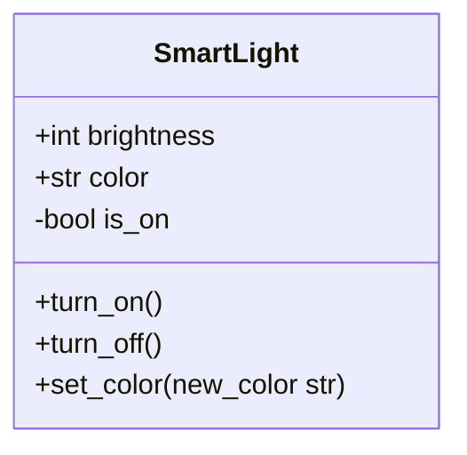
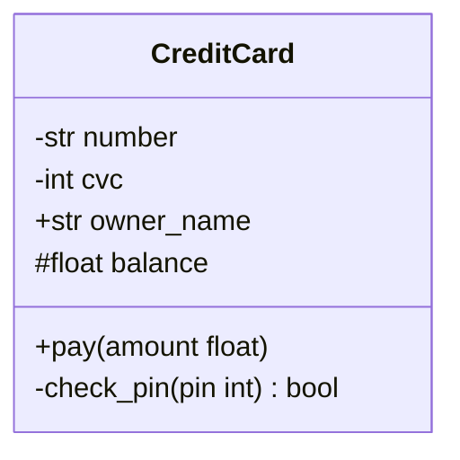
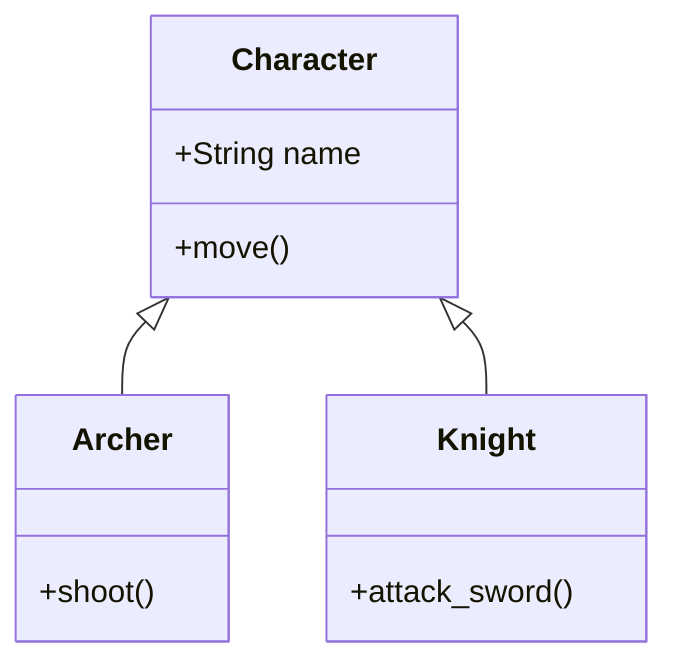
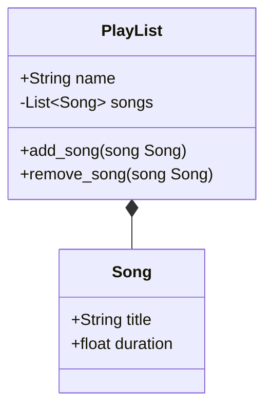
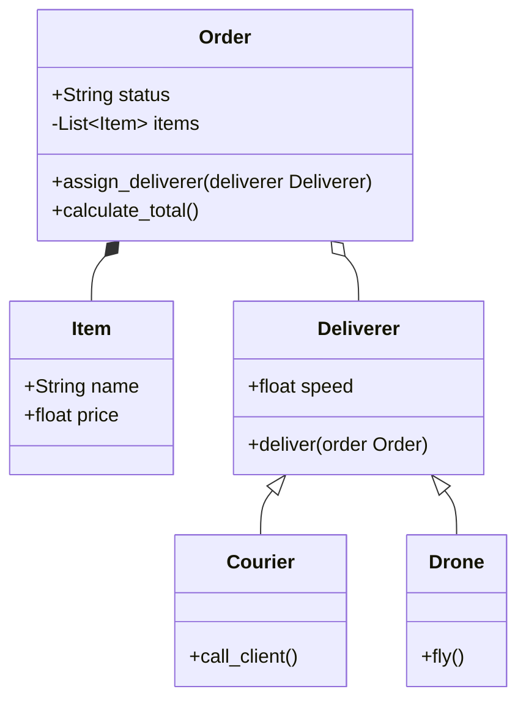
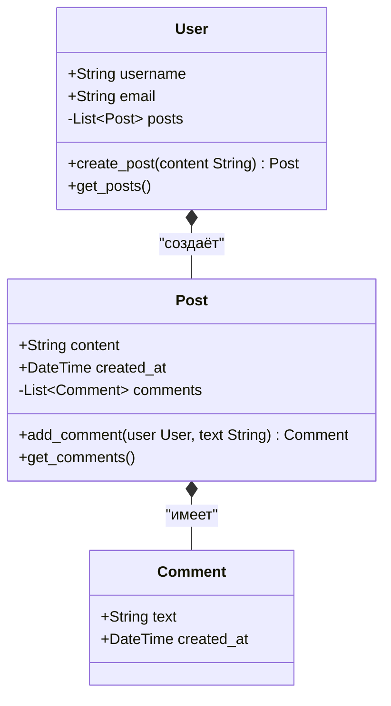

### Практическая часть

#### Задание 1. Базовая структура (Умный дом)
***Решение

#### Задание 2. Инкапсуляция и Безопасность (Банковская карта)
***Решение

#### Задание 3. Наследование (Иерархия RPG)
***Решение

#### Задание 4. Типы связей (Музыкальный плеер)
***Решение

#### Задание 5. Комплексная система (Служба доставки)
***Решение

#### Задание 6
***Решение

