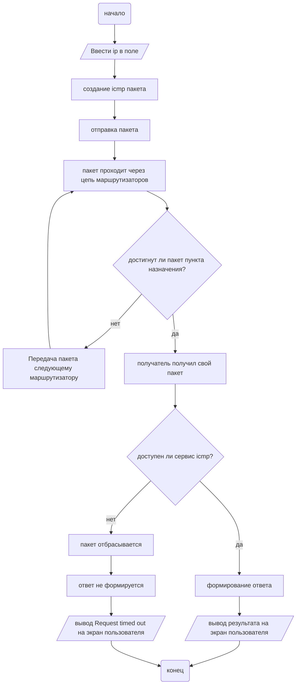

## Составление блок-схем с помощью mermaid

**Цель работы:** Научиться создавать блок-схемы с помощью mermaid

**Задачи работы:**
1. Изучить теоретический материал
2. Составить блок-схемы по заданию
### Практическое часть

#### Задание 1.

Напишите блок схему отправки ping с устройства на устройство.

**Условия**: В блок схеме должно быть: 
- блоки ввода данных для ip
- как минимум один цикл
- блок вывода данных

#### Задание 2.

Вспомните как работает протокол ospf, а в частности его алгоритм поиска кратчайшего пути. Составьте блок-схему отправки сообщения с одного устройства до другого, которые объединены несколькими маршрутизаторами с ospf протоколом.

**Условия**: В блок схеме должно быть: 
- должно быть как минимум одно условие
- должен быть как минимум один цикл
- должна быть как минимум одна определённая переменная

