## Составление блок-схем с помощью mermaid - sequence-диаграммы

**Цель работы:** Научиться создавать sequence-диаграммы с помощью mermaid

**Задачи работы:**
1. Изучить теоретический материал
2. Составить sequence диаграммы по заданию
### Практическое часть

#### Задание 1.

Напишите Sequence-диаграмму отправки ping-запроса на сервер.

**Условия**: В диаграмме должно быть:
- Запрос и ответ от сервера

#### Задание 2.

В теоретической части рассматривался пример авторизации на сайте. Напишите подобную sequence-диаграмму авторизации на сайте, но с двойной аутентификацией.

**Условия**: В диаграмме должно быть:
- Ввод пароля
- Двойная аутентификация (например по смс)

#### Задание 3.

Представьте что вы кассир в Пятерочке. К вам приходит покупатель с покупками. Визуализируйте вашу работу с покупателем и кассой.

**Условия**: 
- Должно быть как минимум 4 объекта

#### Задание 4*.

Представьте что вы осуществляете DDoS атаку на Сервер. Визуализируйте это в диаграмме.

**Условия**:
- Хакер осуществляет атаку асинхронно.
- Нужно показать как сервер перестаёт отвечать на вопросы

```mermaid
sequenceDiagram
    participant Хакер
    participant Ботнет
    participant ЛегитимныйПользователь
    participant Сервер

    Хакер->>Ботнет: Команда на начало DDoS-атаки
    activate Ботнет
    
    par Асинхронная атака
        loop Многократные запросы
            Ботнет->>Сервер: HTTP-запросы (GET/POST)
            activate Сервер
            Сервер->>Сервер: Обработка запроса (высокая нагрузка)
            Сервер-->>Ботнет: Медленный ответ/таймаут
            deactivate Сервер
        end
    and
        loop Флуд соединениями
            Ботнет->>Сервер: SYN-пакеты (TCP flood)
            activate Сервер
            Сервер->>Сервер: Исчерпание ресурсов памяти
            Сервер-->>Ботнет: Нет ответа на некоторые запросы
            deactivate Сервер
        end
    end

    ЛегитимныйПользователь->>Сервер: Легитимный запрос
    activate Сервер
    Сервер->>Сервер: Перегрузка CPU/памяти
    Сервер-->>ЛегитимныйПользователь: Таймаут/ошибка 503
    deactivate Сервер
    
    loop Продолжение атаки
        Ботнет->>Сервер: Новые волны запросов
        activate Сервер
        Сервер->>Сервер: Полная перегрузка ресурсов
        Сервер-->>Ботнет: Connection refused
        deactivate Сервер
    end

    ЛегитимныйПользователь->>Сервер: Повторный запрос
    Сервер-->>ЛегитимныйПользователь: Сервер недоступен
    
    Ботнет-->>Хакер: Отчет об успешной атаке
    deactivate Ботнет
```

